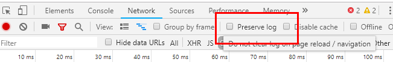
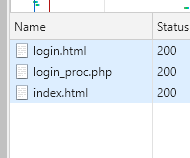
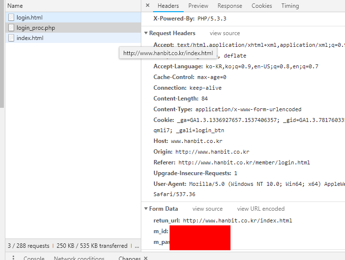

# 로그인 수업

## 목표

한빛 출반 홈페이지에 접속해서 로그인 과정을 거쳐서 *마일리지* 와 *코인*정보를 가져오는 게 목표

## 준비

1. 파이썬
2. `vscode`
3. `requests`
4. `beautifulsoup`

## 한빛 출반 네트워크 로그인 과정 뚫어보기


### 로그인 페이지 분석

- http://www.hanbit.co.kr/member/login.html

```
<div class="w940 wrap_member">
		<!-- 로그인 영역 -->	
		<form name="frm" id="frm" action="#" method="post">
		<input name="retun_url" id="retun_url" type="hidden" value="http://www.hanbit.co.kr/index.html" class="i_text" size="100">
		<div class="login_left">		
			<fieldset>
				<legend>한빛출판네트워크 로그인</legend>
				
				<label class="i_label" for="login_id"><strong style="position: absolute; visibility: hidden;"></strong>
					<input name="m_id" id="m_id" type="text" value="" class="i_text" placeholder="아이디" onkeydown="javascript:if(event.keyCode==13){login_proc(); return false;}">
				</label> 

				<label class="i_label" for="login_pw"><strong style="position: absolute; visibility: hidden;"></strong>
					<input name="m_passwd" id="m_passwd" type="password" value="" class="i_text" placeholder="비밀번호" onkeydown="javascript:if(event.keyCode==13){login_proc(); return false;}">
				</label>
				
				<label>
					<input type="button" name="login_btn" id="login_btn" value="로그인" class="btn_login">					
				</label>
				
				<label class="i_label2">
					<input type="checkbox" name="keepid" id="keepid" value="1" class="i_check"><strong>아이디 저장</strong>
				</label>
			</fieldset>
			
			<ul class="login_btn">
				<li><a href="/member/find_id.html" class="btn_idc">아이디 찾기</a></li>
				<li><a href="/member/find_pw.html" class="btn_pwc">비밀번호 찾기</a></li>
				<li><a href="/member/member_agree.html" class="btn_joinc">회원가입</a></li>
			</ul>
		</div>
		</form>
		<!-- //로그인 영역 -->
		
		<!-- 배너 -->
		<div class="login_right"><a href="/event/current/current_event_view.html?hbe_idx=88&amp;page=0" target="_blank">
					
				</a></div>
		<!-- //배너 -->
	</div>
```

우선 로그인되는 과정을 분석하기 위해서는 크롬에서 `network` /  `doc` 탭에서 흐름을 체크를 하자. 

`preserve log` 라는 곳에 체크를 해야 한다. 이유는 `network` 페이지내에서는 한번 새로 고침을 하는 순간 로그들이 없어지기 때문에 이전 로그들을 남겨야 할려면 체크를 하자. 



로그인을 하는 순간



`login.html` -> `login_proc` -> `index.html` 순으로 흐르게 된다.  기본적인 로그인 흐름을 볼수 있다. 



`Request` 항목에서 `Form Data`를 살펴보면 id, password 등이 주고 받는 걸 볼수 있다.


### 소스 작성

그럼 이제 본격 파이썬으로 진행해보도록 하자. 

우선 패키지 먼저 설치를 하자

```
pip install beautifulsoup4 urljoin load_dotenv
```

그럼 소스 흐름은 

1. 우선 login_proc 에 post로 값을 던져서 세션정보를 가져오도록한다. 
2. 마이 페이지로 접속 후 마일리지와 코인 정보를 가져온다. 

> .env 파일을 만들고 거기에 `USER_ID`와 `USER_PASSWORD`를 지정해주자

```python
import requests
from bs4 import BeautifulSoup
from urllib.parse import urljoin
from dotenv import load_dotenv
import os

# 환경 변수 로드
load_dotenv()

# 아이디와 비밀번호 지정

USER_ID = os.getenv("USER_ID")
USER_PWD = os.getenv("USER_PASSWORD")

# 세션 시작하기
session = requests.session()

# 로그인하기
login_info = {
    "m_id": USER_ID,
    "m_passwd": USER_PWD
}

url_login = "http://www.hanbit.co.kr/member/login_proc.php"
res = session.post(url_login, data=login_info)
# 오류 발생시 예외가 발생한다
res.raise_for_status()

# 마이페이지 접근
url_mypage = "http://www.hanbit.co.kr/myhanbit/myhanbit.html"
res = session.get(url_mypage)
res.raise_for_status()

# 마일리지와 이코인 가져오기
soup = BeautifulSoup(res.text, "html.parser")
mileage = soup.select_one(".mileage_section1 span").get_text()
ecoin = soup.select_one(".mileage_section2 span").get_text()
print("마일리지: " + mileage)
print("이코인: " + ecoin)
```

실행을 해보면 최초 가입시 받는 2,000 코인이 잘 나오는 걸 확인이 가능하다. 

```
> python login_test.py

마일리지: 2,000
이코인: 0
```


### 결론

이상으로 아주 간단한 로그인 스크래핑을 진행했다.  이 스터디는 매주 금요일에 진행되는 파이썬 자동화 수업 중 내용입니다. 